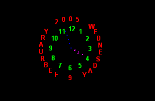



## Clock  \(screenshot\)

### Description

A clock usercontrol. It doesnt get any easier (for you) than this. After downloading now, read the breif readme.txt for correct usage
 
### More Info
 

             |
---                |---
**Submitted On**   |2005-02-09 04:22:46
**By**             |[Evan Toder](https://github.com/Planet-Source-Code/PSCIndex/blob/master/ByAuthor/evan-toder.md)
**Level**          |Intermediate
**User Rating**    |4.4 (31 globes from 7 users)
**Compatibility**  |VB 3\.0, VB 4\.0 \(16\-bit\), VB 4\.0 \(32\-bit\), VB 5\.0, VB 6\.0
**Category**       |[Custom Controls/ Forms/  Menus](https://github.com/Planet-Source-Code/PSCIndex/blob/master/ByCategory/custom-controls-forms-menus__1-4.md)
**World**          |[Visual Basic](https://github.com/Planet-Source-Code/PSCIndex/blob/master/ByWorld/visual-basic.md)
**Archive File**   |[Clock\_\_\(sc185035292005\.zip](https://github.com/Planet-Source-Code/evan-toder-clock-screenshot__1-58801/archive/master.zip)

